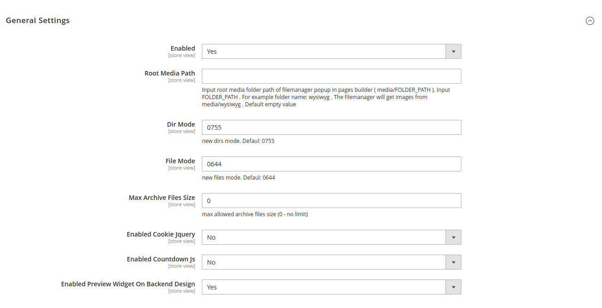

# Base Widget Configuration

Go to admin &gt; Stores &gt; Configuration &gt; Ves Pages Builder &gt; Base Widgets

At here have some settings for base widgets js, media file manager.

**Enabled:** the option to enabled/disable base widgets

**Root Media Path:** Input root media folder path of filemanager popup in pages builder \( media/FOLDER\_PATH \). Input FOLDER\_PATH . For example folder name: wysiwyg . The filemanager will get images from media/wysiwyg . Default empty value

**Dir Mode**: the file permission for directory under Root Media Path when create new via file manager. Default: **0755**

**File Mode:** the file permission for new file was uploaded via File Manager. Default: **0644**

**Max Archive Files** Size: max allowed archive files size \(0 - no limit\)

**Enabled Cookie Jquery:** Enable/Disable call Cookie jquery library js on frontend when use pagebuilder widgets.

**Enabled Countdown js:** Enable/Disable call countdown js file on frontend when use pagebuilder widgets.

**Enabled Preview Widget On Backend Design:** Enable/disable to load preview widget content when build pagebuilder or element builder profile. \(Just support for some widgets: cms block, text, html, image, some other advanced widgets will not show - example: slider, tabs, products list,...\)

