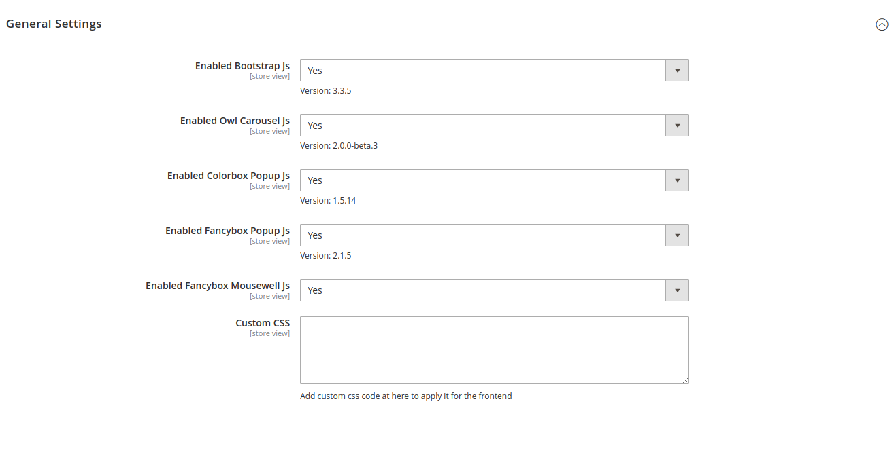

# General Configuration

Go to admin &gt; stores &gt; Configuration &gt; Venustheme.com &gt; All

At here we have some settings to enable/disable common js library on frontend. Some option will been override in Pages Builder Configuration.

**Enabled Bootstrap Js**: enable/disable the bootstrap 3 js on frontend \(disable option when the theme also are using bootstrap\), default enabled.

**Enabled Owl Js**: enable/disable the Owl carousel js on frontend \(disable option when the theme also are using bootstrap\), default enabled.

**Enabled Colorbox Popup Js**: enable/disable the colorbox popup js on frontend \(disable option when the theme also are using bootstrap\), default enabled.

**Enabled Fancybox Popup Js**: enable/disable the Fancybox Popup js on frontend \(disable option when the theme also are using bootstrap\), default enabled.

**Enabled Fancybox Mousewell Js**: enable/disable the Fancybox Mousewell js on frontend \(disable option when the theme also are using bootstrap\), default enabled.

**Custom CSS**: Allow admin input custom css code to override frontend styles.

