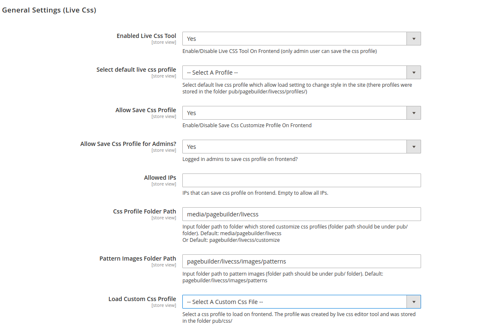
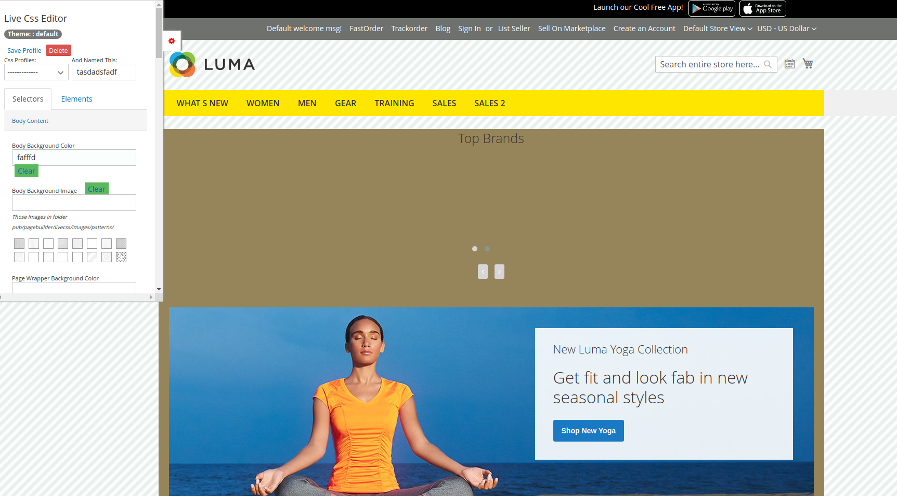
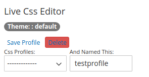

# Live CSS Editor Configuration

The feature is simple live css editor to change common color of elements on frontend \(however they can overrided by current theme\).

Go to Admin &gt; Stores &gt; Configuration &gt; Ves Pages Builder &gt; Live Css Editor 

View it on frontend as this:

After edit css element styles \(color, background, fonts,..\) you can save it by input profile name and click on link "Save Profile".

