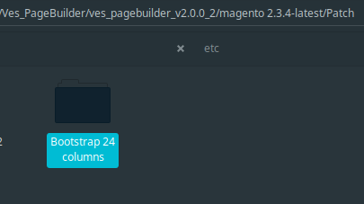
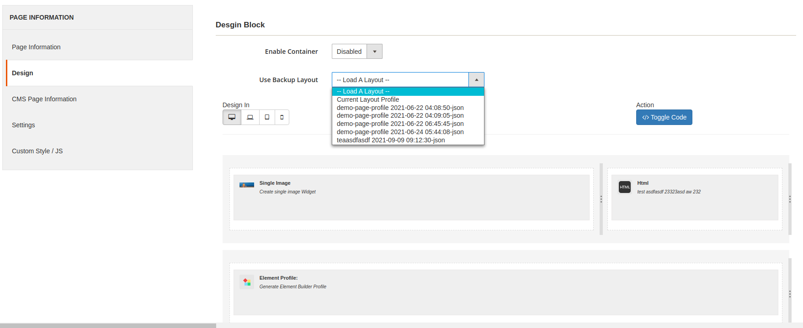
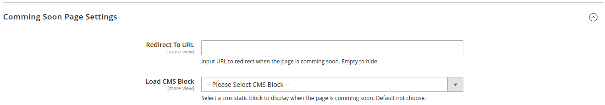
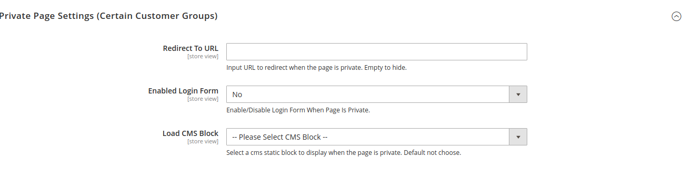

# Pages Builder Configuration

Go to admin &gt; Stores &gt; Configuration &gt; Ves Pages Builder &gt; Pages Builder

**General Settings \(Pages Builder\)**

* **Enabled**: Enabled/Disable Pagebuilder/element builder profile on frontend. When disable this, the pagebuilder/element builder content will not show on frontend.
* **Minify Html Output**: Enable/Disable Minify html for pagebuilder/element builder content before render.
* **Enabled Parallax JS**: Enabled/Disabled load parallax js file on frontend when render pagebuilder.
* **Enabled Fancybox Popup JS:** enable/disable the Fancybox Popup js on frontend \(disable option when the theme also are using bootstrap\), default enabled.
* **Enabled Colorbox Popup JS:** enable/disable the colorbox popup js on frontend \(disable option when the theme also are using bootstrap\), default enabled.
* **Enabled Bootstrap 24 Columns**: Load bootstrap 24 columns for backend of pagebuilder and element builder to build layout with maximum 24 columns. Enabled you should apply bootstrap 24 columns files for the module too \(copy and replace patch files for pagebuilder module\). Disabled default use bootstrap 12 columns.

* **Enabled CSS3 Animation JS:** Enabled/disable animation css effect on frontend. Disable if the theme are using too. More info you can find at here: [https://animate.style/](https://animate.style/)
* **Enabled Image Holder JS:** Enabled/disable load image holder js on frontend of pagebuilder, it allow use holder image. More information you can find at here: [http://holderjs.com/](http://holderjs.com/)
* **Auto Backup Page Builder Profile**: Allow auto backup page builder profile to json file store in the folder "var/cache/vespagebuilder/", then you can rollback old saved content: 

* **Enable Preview Element Profile**: Allow render preview for element profile \(when profile have image and description\), it will show image and description of profile on Builder Design.

**Expired Page Settings:** the settings use when the page builder profile set expired date, it will replace page content or call to action when customer access on the page frontend.

**Redirect To URL**: input url to redirect when customer access expired page on frontend. Empty to use Load CMS Block settings.

**Load CMS Block**: Select a cms static block to display when the page profile expired visible date. Default not choose.

**Comming Soon Page Settings**: the settings use when the page builder profile set comming soon date, it will replace page content or call to action when customer access on the page frontend.

**Redirect To URL**: input url to redirect when customer access comming soon page on frontend. Empty to use Load CMS Block settings.

**Load CMS Block**: Select a cms static block to display when the page profile comming soon date. Default not choose.

**Private Page Settings \(Certain Customer Groups\)**: the settings use when the page builder profile set private access, it will replace page content or call to action when customer access on the page frontend.

**Redirect To URL**: input url to redirect when customer access Private page on frontend. Empty to use Load CMS Block, and Render Login Form settings.

**Enabled Login Form**: Enabled/Disable show login form on private page.

**Load CMS Block**: Select a cms static block to display when the page profile is private for user groups. Default not choose.

