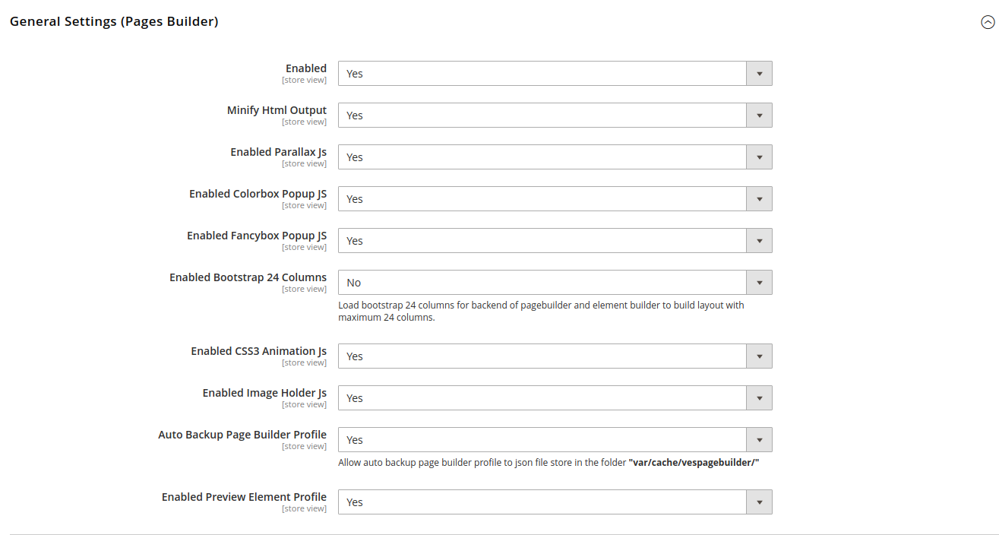
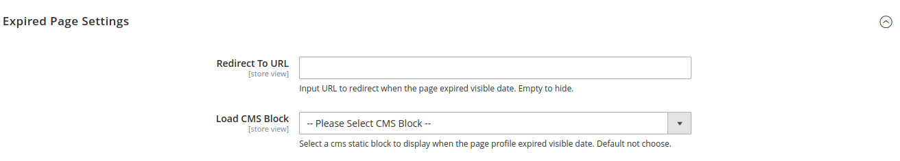

# Pages Builder Configuration

Go to admin &gt; Stores &gt; Configuration &gt; Ves Pages Builder &gt; Pages Builder

**General Settings \(Pages Builder\)**

* **Enabled**: Enabled/Disable Pagebuilder/element builder profile on frontend. When disable this, the pagebuilder/element builder content will not show on frontend.
* **Minify Html Output**: Enable/Disable Minify html for pagebuilder/element builder content before render.
* **Enabled Parallax JS**: Enabled/Disabled load parallax js file on frontend when render pagebuilder.
* Enabled

