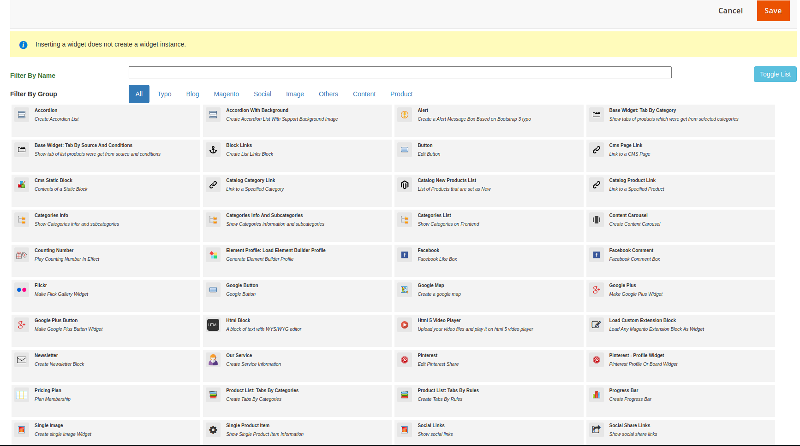

# List of Base Widgets on Page Builder

Base Widgets config files and block code you can find in folder:

**app/code/Ves/BaseWidget/etc/widgets/**

There base widgets of module:

Accordion:

Accordion with Background:

Alert:

Base Widget: Tabs by Category

Base Widget: Tabs by Source and Conditions

Block Links:

Button:

Categories Info:

Categories info and Sub categories:

Categories List:

Content Carousel:

Couting Number:

Facebook:

Facebook Comment: \(will been removed because facebook not support the feature on future\)

Flickr:

Google Button

Google Map:

Google Plus: \(will been removed on new version because google not support it\)

Google Plus Button: \(will been removed on new version because google not support it\)

